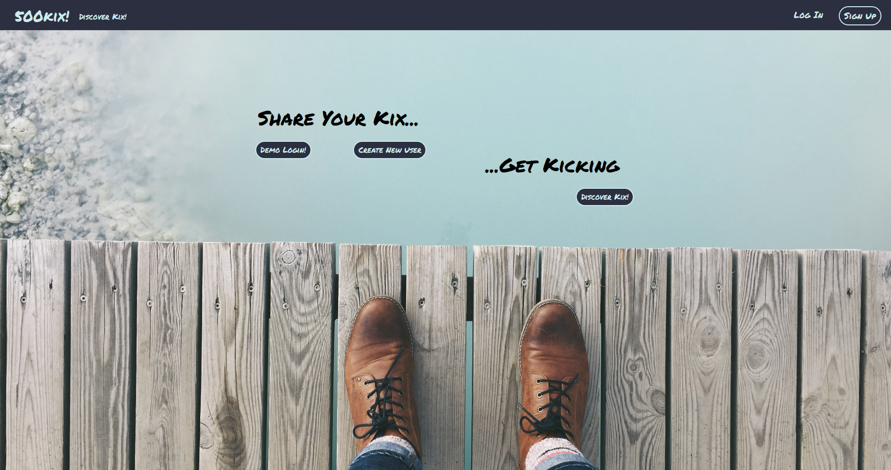
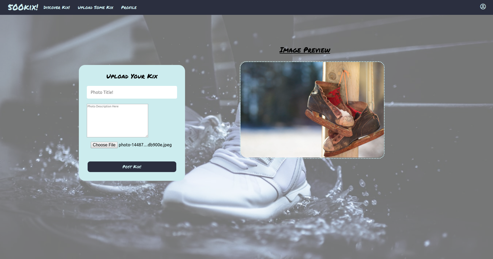
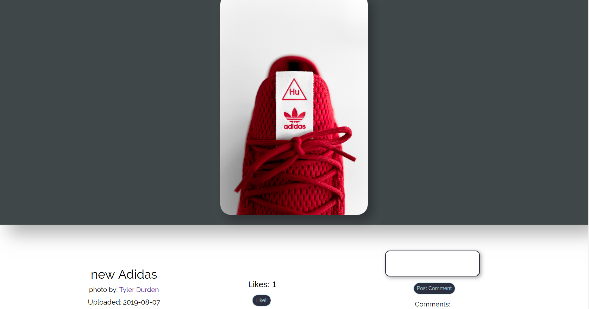
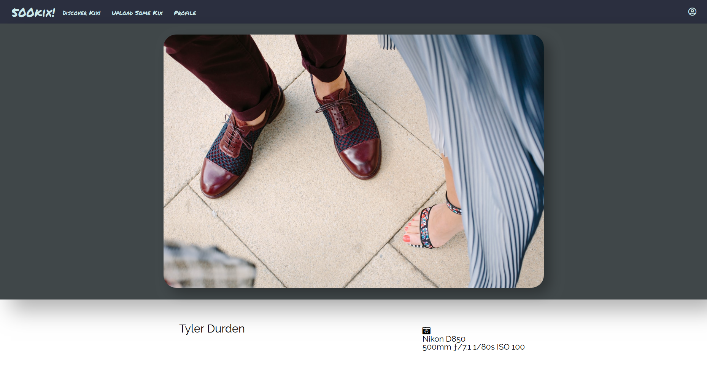

# 500kicks!

https://f500kicks.herokuapp.com/

500kicks is a picture sharing website for photographers to upload pictures, it's a clone of 500px with a themed twist. The theme is that all the photos are images or shoes, or footware.



# Features
    * New account creation, login, and guest login
    * Ability to upload photos
    * Ability to browse a discover page with popular photos
    * Can look your user profile and other profiles, which hold photos you took/uploaded
    * Likes - there is a photo show page that allows you to like photos(if logged in) and keeps track of likes
    * Comments - logged in users can comment on photos

# Project Design

500kicks was designed and built in two weeks. 

A proposal was drafter with a schema, sample state, and backend/frontend routes to guide/outline the process

# Implementation

Passwords are secured using BCrypt to generate a passord_digest. A user session_token is stored in the database to keep track of each user session. When a user successfully logs in, a session token is generated, stored in the database, and stored on the client-side as a browser cookie.

``` ruby
def password=(password)
  @password = password
  self.password_digest = BCrypt::Password.create(password)
  nil
end

def is_password?(password)
  BCrypt::Password.new(password_digest).is_password?(password)
end
```   

### Photo Upload



Images are stored in the AWS database after a user uploads them from a local machine. Images have a photographer_id in the database to link them to a user/uploader. Users have the ability to upload photos from their local machines and they will be stored in my AWS bucket to hold the images. There is an image preview available before you actually upload the image.

### Discover Page


Users can view all the popular photos and all the photos uploaded from the discover page. I fet all the photos from the datbase that are to be displayed on the discover page. Filter options and infinite scroll coming soon, these two features will take me past the span of two weeks.

### Photo Show/Comments/Like



Each photo has the ability to be liked and commented on. In my model associations I create these by having a photo that has many likes and has many comments with the correlating belongs to relationships. The likes and comments component are protected routes and are only available when logged in, although you can see the comments and likes count while not being logged in.  

### Profile Page



A user has a profile page, when I make an ajax request to fetch the user, I also grab their photos from the backend with the same query. The profile page has all the users photos they have uploaded as well a banner image that chooses a photo a user has uploaded at random, or a gray banner if they've uploading nothing. User's camera information is also displayed here.

### Coming Features

There were a couple of features I wanted to implement that I didn't get the chance to, they are as follows.

    * Ability to filter discover page by category
    * A user can follow another user
    * A photo has a pulse depending on how many likes it's received 